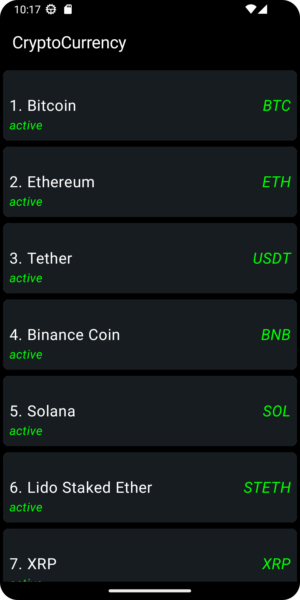
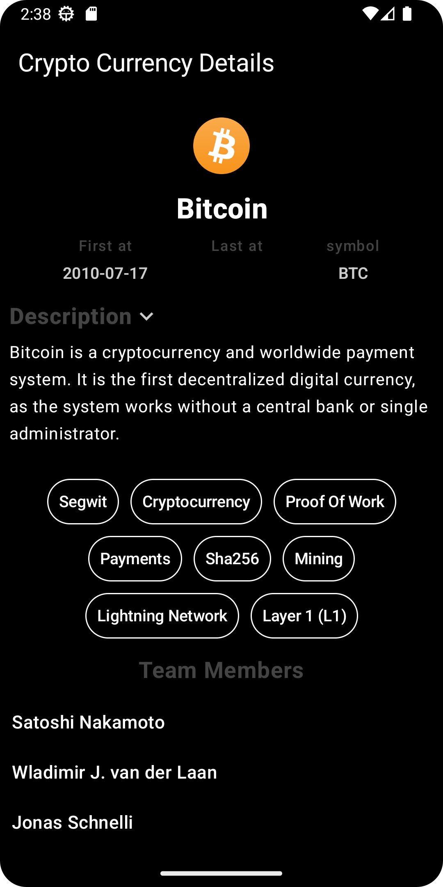

# CoinPaprika Crypto Currency
This project is a Poc based in CoinPaprika Api: https://api.coinpaprika.com/,
was built with Android Studio Android Studio Hedgehog | 2023.1.1 Patch 2, with clean architecture in a multi-modules structure.
The core module is the center and other modules branch off from it. The data module wraps remote.
There's also a common and a domain and navigation module inside the core.

The code is characterized by:

-  :white_check_mark: **Jetpack Compose**: Implementation of the UI with Jetpack Compose, Android's modern UI toolkit.
-  :white_check_mark: **Feature Modularization**: The code is organized into modules based on specific features.
-  :white_check_mark: **Clean Architecture**: Some Applications of Clean Architecture principles for separation of concerns and decoupling.
-  :white_check_mark: **MVVM Pattern (Model-View-ViewModel)**: Use of the MVVM UI pattern for separating business logic and user interface.
-  :white_check_mark: **Dependency Injection with Hilt**: Dependency management using Hilt for dependency injection.
-  :white_check_mark: **Kotlin Coroutines**: For asynchronous tasks.
-  :white_check_mark: **Flow and StateFlow**: Use of these components for managing states and asynchronous interactions.

The project also integrates other technologies and libraries, such as `Retrofit` for network calls

---

This project has been developed in Android Studio version:
-  `Hedgehog | 2023.1.1 Patch 2`
-  `Build #AI-223.8836.35.2231.10811636`
-  `Java JDK 17`

## Module Dependencies docs
* [Compose](https://developer.android.com/jetpack/compose/documentation)

* [Modularization](https://developer.android.com/topic/modularization)

* [Kotlin Coroutines](https://developer.android.com/kotlin/coroutines)

* [Koin dependency injection](https://developer.android.com/training/dependency-injection/hilt-android)
    
* [Clean architecture](https://blog.cleancoder.com/uncle-bob/2012/08/13/the-clean-architecture.html)

* [StateFlow for View states](https://developer.android.com/kotlin/flow/)

* [Mockk](https://mockk.io/ANDROID.html)

## Screens

  
